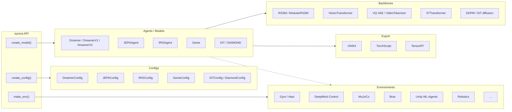

<h1 align="center">
  <picture>
    <source media="(prefers-color-scheme: dark)" srcset="https://raw.githubusercontent.com/ParamThakkar123/synora/main/docs/source/_static/synora-logo-dark.svg">
    
  </picture>
</h1>

<div align="center">
  <p>
    <a href="https://pypi.org/project/synora-world/"></a>
    <a href="https://pypi.org/project/synora-world/"></a>
    <a href="https://opensource.org/licenses/MIT"></a>
    <a href="https://paramthakkar123.github.io/synora/"></a>
    <a href="https://github.com/paramthakkar123/synora/actions/workflows/test.yml"></a>
  </p>
  <p><strong>Modular PyTorch library for world models — many algorithms, one consistent API.</strong></p>
</div>

> **Formerly TorchWM.** The project was renamed to Synora for 1.0 and is
> published on PyPI as `synora-world`: `pip install synora-world`, then `import synora`.

**Synora brings the major world-model families together under a single PyTorch API.** Train Dreamer, PlaNet, JEPA, IRIS, DIAMOND, DiT, and Genie agents through `create_config` / `create_model` / `make_env`, or drop down to their encoders, decoders, and latent-dynamics backbones to compose your own architecture. Environment adapters (Gym/Gymnasium, DeepMind Control, MuJoCo, Brax, Atari, Unity ML-Agents) and ONNX / TorchScript / TensorRT export come built in.

## See it in action

Every model ships with a demo that trains from scratch on a laptop GPU (RTX
3050, 4 GB) in one to two hours and records what it learned. These are short
runs, not paper-scale results: the point is to show what each model does.

<table>
<tr>
<td width="50%" valign="top"><a href="https://paramthakkar123.github.io/synora/gallery.html#gallery-dreamer"></a><br><b>Dreamer</b>: the real environment (left) beside the world model imagining it open loop (right).</td>
<td width="50%" valign="top"><a href="https://paramthakkar123.github.io/synora/gallery.html#gallery-diamond"></a><br><b>DIAMOND</b>: Breakout in the emulator beside a diffusion model generating every frame itself.</td>
</tr>
<tr>
<td width="50%" valign="top"><a href="https://paramthakkar123.github.io/synora/gallery.html#gallery-genie"></a><br><b>Genie</b>: a real Sonic clip beside Genie regenerating it from the first frame, with actions it learned from unlabelled video.</td>
<td width="50%" valign="top"><a href="https://paramthakkar123.github.io/synora/gallery.html#gallery-iris"></a><br><b>IRIS</b>: a policy playing Pong inside a Transformer world model made of discrete tokens.</td>
</tr>
<tr>
<td width="50%" valign="top"><a href="https://paramthakkar123.github.io/synora/gallery.html#gallery-planet"></a><br><b>PlaNet</b>: a latent model predicting the future while a CEM planner searches inside it.</td>
<td width="50%" valign="top"><a href="https://paramthakkar123.github.io/synora/gallery.html#gallery-dit"></a><br><b>DiT</b>: CIFAR-10 samples from a class-conditional Diffusion Transformer, one row per class.</td>
</tr>
</table>

More clips, learning curves and the commands to reproduce each one are in the
[gallery](https://paramthakkar123.github.io/synora/gallery.html); the scripts live in [`demos/`](demos/).

## Quick Start

```bash
# Install the core package from PyPI.
# This keeps environment integrations and experiment logging optional.
pip install synora-world

# With extras
pip install synora-world[gym]       # Gym/Gymnasium environments (runnable quick start)
pip install synora-world[dmc]       # DeepMind Control Suite (walker-walk, cheetah-run, ...)
                               # On CPython 3.13 also run: python -m synora.install_dmc
pip install synora-world[worldmodels] # Classic World Models (ConvVAE + CMA-ES controller)
pip install synora-world[ml-agents] # Unity ML-Agents
pip install synora-world[ml]        # TensorBoard, W&B logging
pip install synora-world[viz]       # Latent-space visualization (plotly, UMAP)
pip install synora-world[dev]       # Testing and linting

# Or add it to a uv-managed project.
uv add synora-world
```

Synora depends on PyTorch but does not force a single PyTorch wheel index. If you need a specific PyTorch build, install or add the PyTorch packages with the index recommended for your platform by the [PyTorch installation selector](https://pytorch.org/get-started/locally/):

```bash
# Example: CUDA 12.1 wheels. Choose a different index for CPU, ROCm, CUDA 11.x, CUDA 12.4+, or macOS.
uv add torch torchvision torchaudio --index https://download.pytorch.org/whl/cu121
```

Use the friendly top-level API for the common path. The example below runs on a
base `pip install synora-world[gym]` — no simulator downloads required:

```python
import synora

# Trains a Dreamer agent on a Gymnasium task. Bump `total_steps` for real runs.
# `seed_steps` of random play come first and count towards `total_steps`; the
# final checkpoint is written to `<logdir>/ckpts/` when training finishes.
agent = synora.create_model(
    "dreamer",
    env="Pendulum-v1",
    env_backend="gym",
    seed_steps=1_000,
    total_steps=10_000,
)
agent.train()
```

To train on DeepMind Control tasks such as `walker-walk`, install the DMC extra
(`pip install synora-world[dmc]`) and use the default backend:

```python
agent = synora.create_model("dreamer", env="walker-walk", total_steps=1_000_000)
agent.train()
```

### Swap the algorithm, keep the code

Every algorithm in the table below is reachable through the same factory, so
comparing them is a loop rather than a rewrite:

```python
import synora

for algo in ["dreamer-v1", "dreamer-v2"]:
    agent = synora.create_model(
        algo, env="Pendulum-v1", env_backend="gym", total_steps=20_000
    )
    agent.train()
```

`examples/algorithm_comparison.py` runs exactly this and writes a comparison
plot. Construction is unified across all registered models. A shared
step-budget `train()` currently covers the Dreamer family — other agents use
their own trainers (`synora train …` / `JEPAAgent.train()` / `DiamondAgent.train()`).
The example reports which is which rather than assuming.

## Features

- Unified interfaces across world-model algorithms
- Modular encoders, decoders, dynamics models, and backbones
- Training and inference utilities for model-based reinforcement learning
- Environment integrations for Gym/Gymnasium, Unity ML-Agents, MuJoCo, Brax, and robotics extras
- Optional logging, visualization, development, and documentation extras

## Architecture



## Supported Algorithms

Every row is a registry entry — pass the name straight to `synora.create_model(...)`
or `synora.create_config(...)`. Run `synora.list_models()` for the live list.

| Name | Algorithm | Description | Key Features |
|------|-----------|-------------|--------------|
| `dreamer` | **Dreamer** | Model-based RL with latent dynamics (alias for `dreamer-v1`) | Imagination, actor-critic |
| `dreamer-v1` | **DreamerV1** | Latent imagination with Gaussian heads | Normal heads, standard KL |
| `dreamer-v2` | **DreamerV2** | Discrete latents for pixel control | Symlog two-hot heads, balanced KL |
| `planet` | **PlaNet** | Latent planning from pixels, no explicit policy | RSSM, CEM planner |
| `modular-rssm` | **ModularRSSM** | Composable recurrent state-space model | Swappable priors/posteriors, custom heads |
| `iris` | **IRIS** | Sample-efficient RL with Transformers | Discrete VAEs, world models |
| `jepa` | **JEPA** | Self-supervised visual representations | Masked prediction, ViT |
| `dit` | **DiT** | Diffusion Transformer workflows | Patch embeddings, diffusion backbones |
| `diamond` | **DIAMOND** | Diffusion world model for pixel-control RL | EDM sampling, Atari imagination rollouts |
| `genie` | **Genie** | Generative interactive environments from video | Latent actions, spatiotemporal transformer |
| `genie-small` | **Genie (small)** | Development- and test-sized Genie | Same architecture, reduced width/depth |
| `genie-large` | **Genie (large)** | Scaled-up Genie variant | Higher capacity dynamics + tokenizer |

## Documentation

- [Full Documentation](https://paramthakkar123.github.io/synora/)
- [Installation Guide](https://paramthakkar123.github.io/synora/installation.html)
- [Training Guide](https://paramthakkar123.github.io/synora/training_guide.html)
- [API Reference](https://paramthakkar123.github.io/synora/api_reference.html)

## Community

- [Issue Tracker](https://github.com/paramthakkar123/synora/issues)
- [Discussions](https://github.com/paramthakkar123/synora/discussions)
- [PyPI](https://pypi.org/project/synora-world/)
- [Contributing Guide](CONTRIBUTING.md)
- [Code of Conduct](CODE_OF_CONDUCT.md)

> Synora follows [semantic versioning](https://semver.org/) as of 1.0.0. The
> public API — everything listed in the [Public API reference](https://paramthakkar123.github.io/synora/public_api.html)
> and re-exported from the top-level `synora` namespace — will not break within
> the 1.x line; anything removed gets a deprecation warning for at least one
> minor release first. Submodule internals not listed there may still change.
