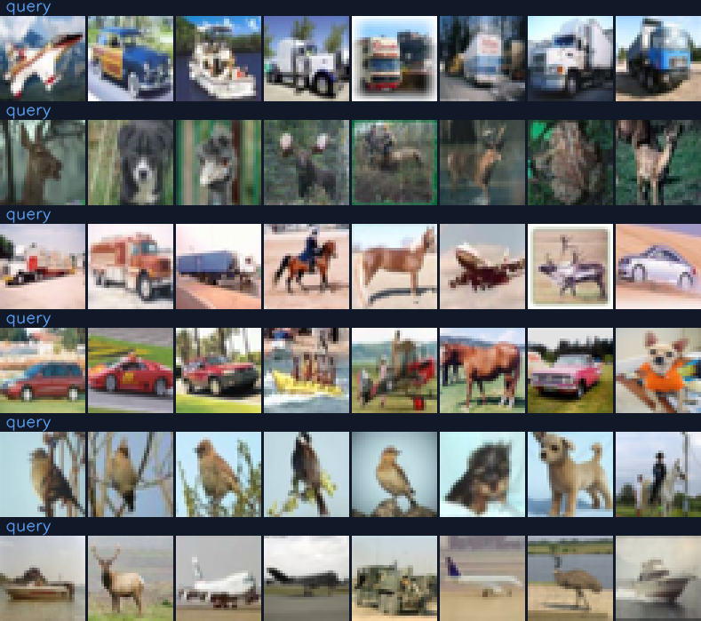
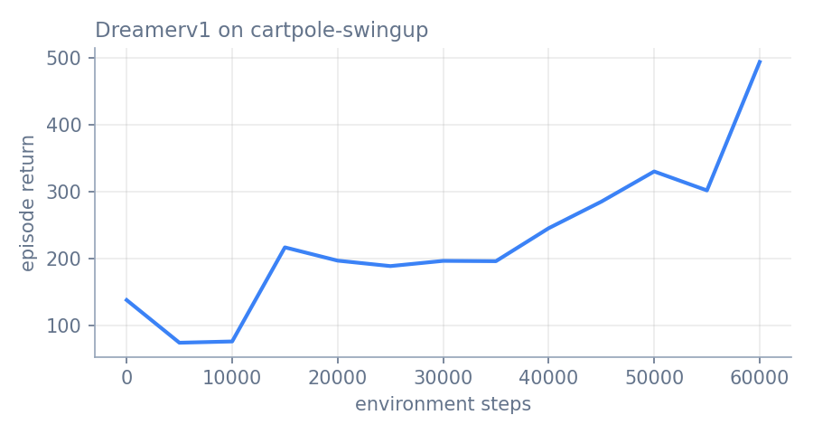
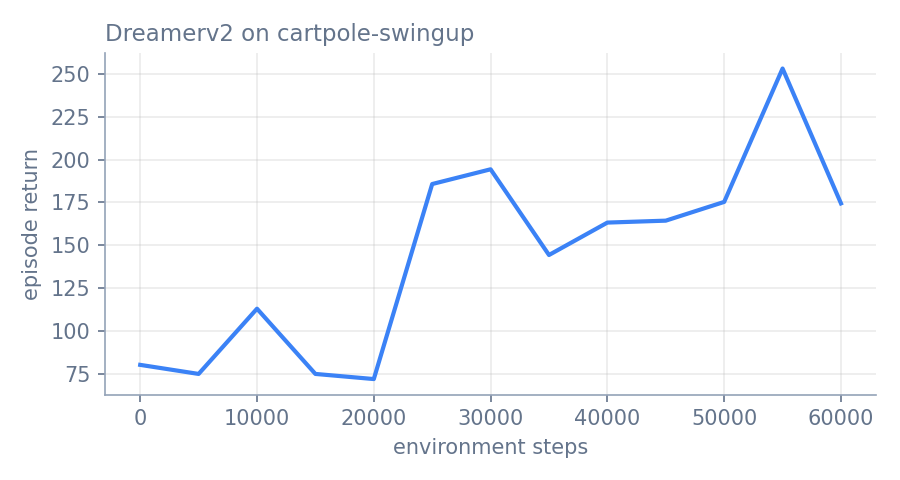
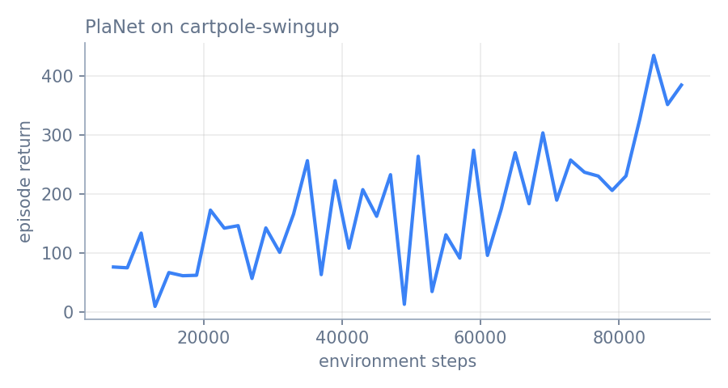
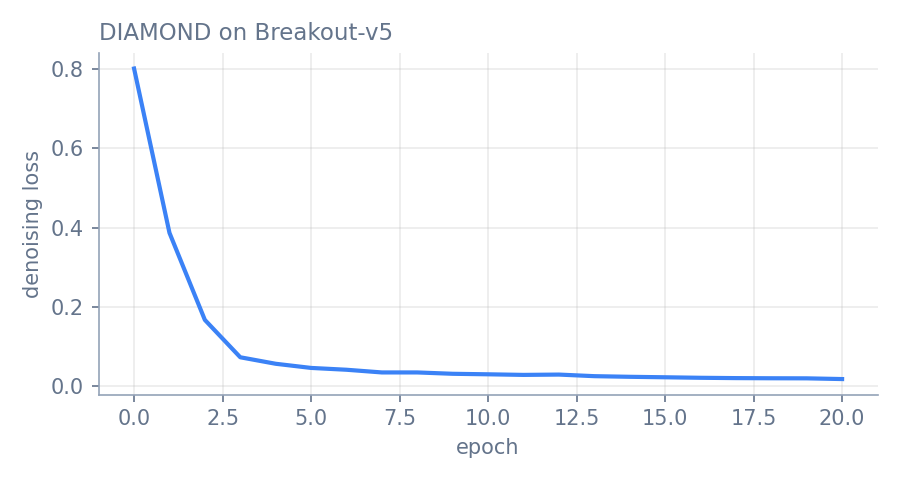
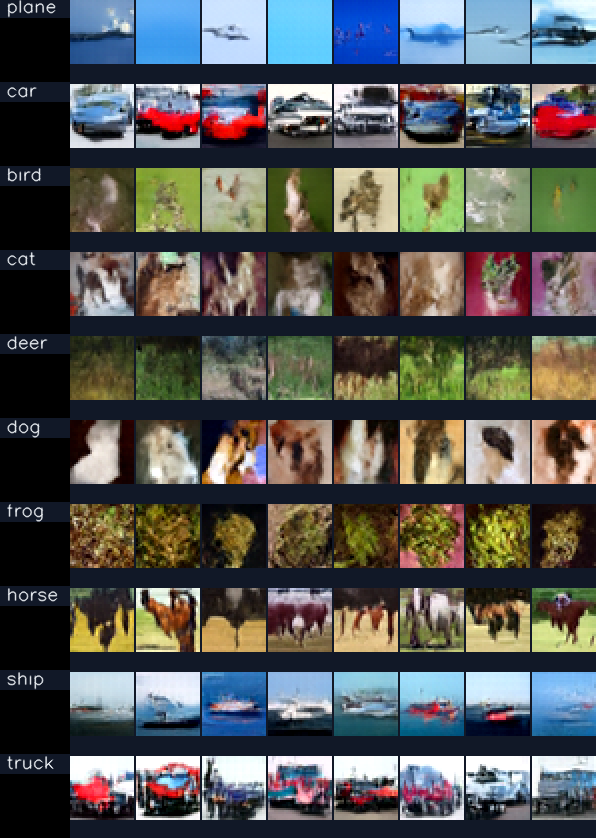
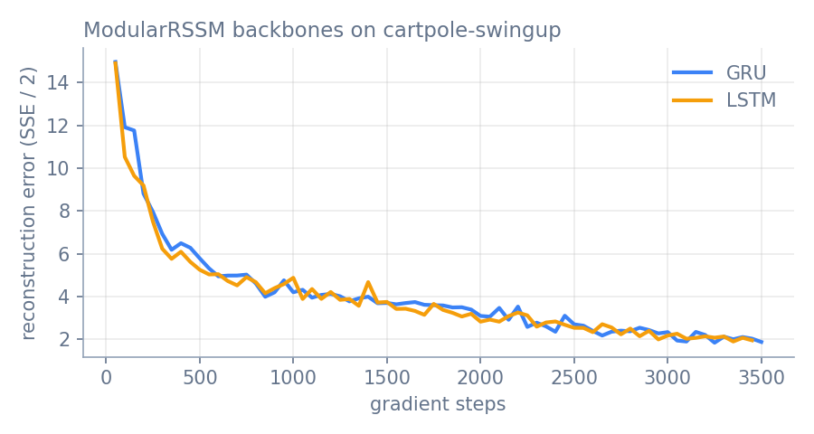
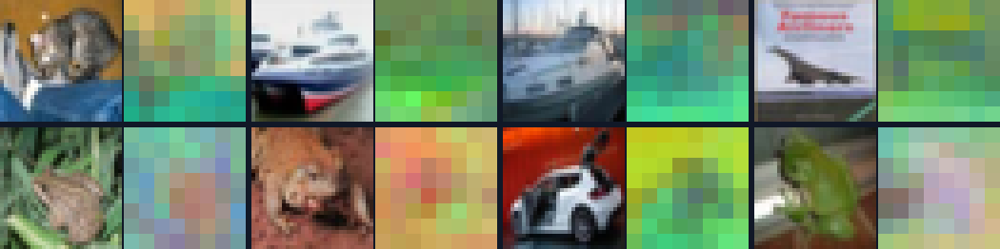

# Gallery

What every model in Synora looks like in action. Each clip below was produced by
the scripts in [`demos/`](https://github.com/ParamThakkar123/synora/tree/main/demos),
trained from scratch on a single **laptop GPU (RTX 3050, 4 GB)** for one to two
hours. They show what the library does in a short budget, not the paper results,
which need far more compute. Every section ends with the commands that
reproduce it.

```{raw} html
<div class="demo-grid">
  <a class="demo-card" href="#gallery-dreamer">
    <video src="_static/gallery/dreamer_dream.mp4" autoplay loop muted playsinline preload="metadata"></video>
    <span class="demo-card-body"><span class="demo-card-title">Dreamer</span><span class="demo-card-text">Learns a world model from pixels and trains its policy inside it.</span></span>
  </a>
  <a class="demo-card" href="#gallery-planet">
    <video src="_static/gallery/planet_dream.mp4" autoplay loop muted playsinline preload="metadata"></video>
    <span class="demo-card-body"><span class="demo-card-title">PlaNet</span><span class="demo-card-text">Plans every action by searching inside its learned latent model.</span></span>
  </a>
  <a class="demo-card" href="#gallery-diamond">
    <video src="_static/gallery/diamond_dream.mp4" autoplay loop muted playsinline preload="metadata"></video>
    <span class="demo-card-body"><span class="demo-card-title">DIAMOND</span><span class="demo-card-text">A diffusion model that generates the next Atari frame.</span></span>
  </a>
  <a class="demo-card" href="#gallery-iris">
    <video src="_static/gallery/iris_dream.mp4" autoplay loop muted playsinline preload="metadata"></video>
    <span class="demo-card-body"><span class="demo-card-title">IRIS</span><span class="demo-card-text">A Transformer that imagines Atari as sequences of discrete tokens.</span></span>
  </a>
  <a class="demo-card" href="#gallery-genie">
    <video src="_static/gallery/genie_replay.mp4" autoplay loop muted playsinline preload="metadata"></video>
    <span class="demo-card-body"><span class="demo-card-title">Genie</span><span class="demo-card-text">A playable world model learned from unlabelled gameplay video.</span></span>
  </a>
  <a class="demo-card" href="#gallery-dit">
    <video src="_static/gallery/dit_denoising.mp4" autoplay loop muted playsinline preload="metadata"></video>
    <span class="demo-card-body"><span class="demo-card-title">DiT</span><span class="demo-card-text">A class-conditional Diffusion Transformer denoising CIFAR-10.</span></span>
  </a>
  <a class="demo-card" href="#gallery-modular-rssm">
    <video src="_static/gallery/modular_rssm_dream.mp4" autoplay loop muted playsinline preload="metadata"></video>
    <span class="demo-card-body"><span class="demo-card-title">ModularRSSM</span><span class="demo-card-text">Swap a world model's backbone and compare the predictions.</span></span>
  </a>
  <a class="demo-card" href="#gallery-i-jepa">
    
    <span class="demo-card-body"><span class="demo-card-title">I-JEPA</span><span class="demo-card-text">Self-supervised image features, learned without pixels or labels.</span></span>
  </a>
</div>
```

## How to read the world-model clips

Most clips put the **real environment on the left** and the **world model on the
right**. The model is shown a few real frames ("observed"), then its
observations are cut off and it predicts every later frame on its own
("imagined t+k"), given the same actions the agent takes in the real
environment. Nothing on the right is copied from the left: wherever the two
halves drift apart is exactly where the model is wrong.

---

(gallery-dreamer)=
## Dreamer

Dreamer learns a recurrent state-space model of the environment from pixels,
then trains an actor-critic purely on imagined trajectories. Here it is on the
DeepMind Control *cartpole swing-up* task (60k environment steps).

```{raw} html
<figure class="demo-media">
  <video src="_static/gallery/dreamer_dream.mp4" autoplay loop muted playsinline preload="metadata"></video>
  <figcaption>Left: the real environment. Right: Dreamer's world model, given 5 real frames and then imagining the next 45 open loop from the policy's actions.</figcaption>
</figure>
<div class="demo-pair">
  <figure class="demo-media">
    <video src="_static/gallery/dreamer_policy.mp4" autoplay loop muted playsinline preload="metadata"></video>
    <figcaption>The policy, trained only in imagination, swinging the pole up in the real environment.</figcaption>
  </figure>
  <figure class="demo-media">
    
    <figcaption>Evaluation return over training.</figcaption>
  </figure>
</div>
```

```bash
python demos/dreamer_demo.py train --env cartpole-swingup --steps 60000
python demos/dreamer_demo.py record
```

**DreamerV2** swaps in symlog two-hot reward and value heads and a balanced KL.
Train it with `create_model("dreamer-v2")`, or:

```{raw} html
<div class="demo-pair">
  <figure class="demo-media">
    <video src="_static/gallery/dreamer_v2_dream.mp4" autoplay loop muted playsinline preload="metadata"></video>
    <figcaption>DreamerV2 on the same task: real environment and open-loop imagination.</figcaption>
  </figure>
  <figure class="demo-media">
    
    <figcaption>DreamerV2 evaluation return over training.</figcaption>
  </figure>
</div>
```

```bash
python demos/dreamer_demo.py train --algo dreamer-v2 --run demos/runs/dreamer_v2
python demos/dreamer_demo.py record --run demos/runs/dreamer_v2
```

See {doc}`dreamer` for the method and the full API.

---

(gallery-planet)=
## PlaNet

PlaNet has no policy network. At every step it searches over action sequences
with the cross-entropy method *inside* its learned latent model and executes the
first action of the best plan. Same task as Dreamer, so the two are comparable.

```{raw} html
<figure class="demo-media">
  <video src="_static/gallery/planet_dream.mp4" autoplay loop muted playsinline preload="metadata"></video>
  <figcaption>Left: the real environment. Right: PlaNet's latent model predicting open loop from the planner's actions.</figcaption>
</figure>
<div class="demo-pair">
  <figure class="demo-media">
    <video src="_static/gallery/planet_policy.mp4" autoplay loop muted playsinline preload="metadata"></video>
    <figcaption>The CEM planner controlling the real environment.</figcaption>
  </figure>
  <figure class="demo-media">
    
    <figcaption>Evaluation return over training.</figcaption>
  </figure>
</div>
```

```bash
python demos/planet_demo.py train --minutes 75
python demos/planet_demo.py record
```

See {doc}`planet`.

---

(gallery-diamond)=
## DIAMOND

DIAMOND's world model is a diffusion model: it generates each next Atari frame
by denoising, conditioned on the previous four frames and the action. The agent
is trained entirely on frames the model generates.

```{raw} html
<figure class="demo-media">
  <video src="_static/gallery/diamond_dream.mp4" autoplay loop muted playsinline preload="metadata"></video>
  <figcaption>Left: Breakout in the emulator. Right: the diffusion model, started from the same four frames and fed the same actions, generating every later frame from its own previous outputs.</figcaption>
</figure>
<div class="demo-pair">
  <figure class="demo-media">
    <video src="_static/gallery/diamond_play_in_dream.mp4" autoplay loop muted playsinline preload="metadata"></video>
    <figcaption>The agent playing entirely inside the world model; no emulator is involved.</figcaption>
  </figure>
  <figure class="demo-media">
    
    <figcaption>Denoising loss over training.</figcaption>
  </figure>
</div>
```

```bash
python demos/diamond_demo.py train --epochs 21
python demos/diamond_demo.py record
```

To drive the model yourself with the keyboard, run
`synora play --model diamond -c demos/runs/diamond/checkpoint_20.pt --game Breakout-v5`
and press `TAB` to switch between the real game and the dream. See {doc}`diamond`.

---

(gallery-iris)=
## IRIS

IRIS compresses every frame into 16 discrete tokens with a VQ autoencoder,
then models the game as a sequence of tokens and actions with a Transformer. The
policy learns from Transformer imagination only.

```{raw} html
<div class="demo-pair">
  <figure class="demo-media">
    <video src="_static/gallery/iris_tokens.mp4" autoplay loop muted playsinline preload="metadata"></video>
    <figcaption>Each real Pong frame (left) and its reconstruction from 16 tokens (right): the only view of the game the world model gets.</figcaption>
  </figure>
  <figure class="demo-media">
    <video src="_static/gallery/iris_dream.mp4" autoplay loop muted playsinline preload="metadata"></video>
    <figcaption>The policy acting inside the Transformer's imagination, starting from one real frame.</figcaption>
  </figure>
</div>
<figure class="demo-media">
  
  <figcaption>Autoencoder reconstruction loss and the Transformer's next-token loss over training.</figcaption>
</figure>
```

```bash
python demos/iris_demo.py train --minutes 100
python demos/iris_demo.py record
```

The demo keeps the paper configuration and only scales down the work per epoch
and the batch sizes. See {doc}`iris`.

---

(gallery-genie)=
## Genie

Genie learns from gameplay video alone, with no actions recorded. A latent
action model discovers a small vocabulary of "controls" from how consecutive
frames differ, and a MaskGIT dynamics model generates the next frame given one.
Trained here on Sonic from the TinyWorlds dataset.

```{raw} html
<figure class="demo-media">
  <video src="_static/gallery/genie_replay.mp4" autoplay loop muted playsinline preload="metadata"></video>
  <figcaption>Left: a real clip. Right: Genie's generation from only its first frame, driven by the latent actions it inferred from the real clip.</figcaption>
</figure>
<div class="demo-pair">
  <figure class="demo-media">
    <video src="_static/gallery/genie_actions.mp4" autoplay loop muted playsinline preload="metadata"></video>
    <figcaption>One starting frame, played forward under each of the 8 latent actions Genie discovered.</figcaption>
  </figure>
  <figure class="demo-media">
    <video src="_static/gallery/genie_tokens.mp4" autoplay loop muted playsinline preload="metadata"></video>
    <figcaption>Real frames and their reconstruction from Genie's video tokens.</figcaption>
  </figure>
</div>
```

```bash
python demos/genie_demo.py train --steps 6000
python demos/genie_demo.py record
```

See {doc}`genie`.

---

(gallery-dit)=
## DiT

A Diffusion Transformer (DiT-S/4) trained class-conditionally on CIFAR-10, and
sampled with classifier-free guidance.

```{raw} html
<div class="demo-pair">
  <figure class="demo-media">
    <video src="_static/gallery/dit_denoising.mp4" autoplay loop muted playsinline preload="metadata"></video>
    <figcaption>Denoising from pure Gaussian noise over 1000 DDPM steps; one row per class.</figcaption>
  </figure>
  <figure class="demo-media">
    
    <figcaption>Final samples, one row per CIFAR-10 class.</figcaption>
  </figure>
</div>
```

```bash
python demos/dit_demo.py train --epochs 40
python demos/dit_demo.py record
```

See {doc}`dit`.

---

(gallery-modular-rssm)=
## ModularRSSM

`ModularRSSM` builds a world model from interchangeable parts: an encoder, a
decoder and a recurrent backbone. The demo trains the same encoder and decoder
with a GRU and with an LSTM backbone on identical data, then lets both predict
the future.

```{raw} html
<figure class="demo-media">
  <video src="_static/gallery/modular_rssm_dream.mp4" autoplay loop muted playsinline preload="metadata"></video>
  <figcaption>Real frames, then the GRU and LSTM world models predicting open loop from the same actions.</figcaption>
</figure>
<figure class="demo-media">
  
  <figcaption>Reconstruction loss for both backbones.</figcaption>
</figure>
```

```bash
python demos/modular_rssm_demo.py train --minutes-per-backbone 25
python demos/modular_rssm_demo.py record
```

See {doc}`modular_rssm_guide`.

---

(gallery-i-jepa)=
## I-JEPA

I-JEPA learns image features without reconstructing pixels and without labels:
it predicts the *representations* of masked image blocks from a visible context
block. A ViT-Tiny trained on CIFAR-10 shows what that buys.

```{raw} html
<figure class="demo-media">
  
  <figcaption>Each row: a test image (left) and its nearest training images in the encoder's feature space. No labels were used to train the encoder or to find the neighbours.</figcaption>
</figure>
<figure class="demo-media">
  
  <figcaption>Patch features projected onto their top three principal components and shown as colour: patches the encoder considers similar get similar colours.</figcaption>
</figure>
```

```bash
python demos/jepa_demo.py train --epochs 30
python demos/jepa_demo.py record
```

See {doc}`jepa`.

---

## Reproduce everything

```bash
python demos/run_all.py            # trains and records every demo, about ten hours on a 4 GB laptop GPU
python demos/build_gallery.py      # copies the media into docs/source/_static/gallery
```

Each demo runs on its own, one after another: several hold gigabytes of replay
data in RAM and most of a 4 GB GPU. See
[`demos/README.md`](https://github.com/ParamThakkar123/synora/blob/main/demos/README.md)
for details and per-demo options.
